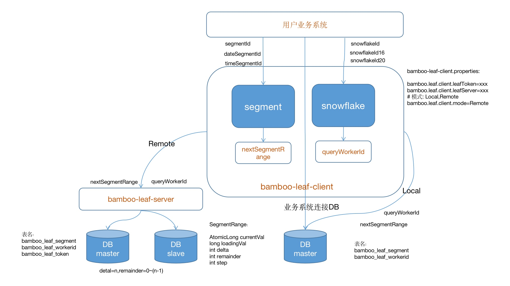

# bamboo-leaf简介
> Bamboo-leaf是用Java开发的一款分布式id生成系统，leaf-segment算法是基于数据库号段(segment)算法进行深度优化及扩展。
leaf-snowflake算法是基于原生雪花(snowflake)算法进行深度优化及扩展。重定义了snowflake各段的长度，解决了workerid的节点限制问题及时间回拨序列重复的问题，提升了每毫秒产生的序列个数。
Bamboo-leaf 分步式序列能适合更多的场景，高并发、高可用得到提升，接入更方便简洁。
同时提供了Bamboo-leaf-client(sdk)使id生成本地化，获得了更好的性能与可用性。均通过Bamboo-leaf-client方式接入，每天生成百亿级别的id。
[更详细文档请看](https://gitee.com/sunney/bamboo-leaf/wikis/Home?sort_id=3295968)

# bamboo-leaf架构图

# bamboo-leaf代码结构
bamboo-leaf
- ---bamboo-leaf-server
- ---bamboo-leaf-client
- ---bamboo-leaf-core
- ---bamboo-leaf-autoconfigure
- ---bamboo-leaf-demo

# bamboo-leaf接口列表
## 1、snowflake算法接口列表
   接口类：BambooLeafSnowflakeClient
| 序号 | 接口 | 名称 | 功能说明 |
|----|----|----|------|
|   1|public long snowflakeId(String namespace);| 雪花算法   |   返回Long类型   |
|   2|public String snowflakeId16(String namespace); |  雪花算法+随机数  | 返回16位字段串: 13位(原生雪花算法转36进制),  3位(随机数转36进制)   |
|   3|public String snowflakeId20(String namespace); |  雪花算法+namespace+随机数  |  返回20位字段串: 13位(原生雪花算法转36进制),  3位(namespace转36进制)，  3位(随机数转36进制)    |

## 2、segment算法接口列表
接口类：BambooLeafSnowflakeClient
| 序号 | 接口 | 名称 | 功能说明 |
|----|----|----|------|
|   1|public Long segmentId(String namespace);| 返回1~Long.MAX_VALUE   |   返回Long类型   |
|   2|public Long dateSegmentId(String namespace); |  返回19位日期long的序列 格式：8位yyyyMMdd+11位序列  | 例如:202101010000000001 序列大于99999999999后会重置。 该算法每天最大99999999999序号 |
|   3|public String dateSegmentId(String namespace, String prefix);| 返回前缀+日期String的序列 格式：前缀+8位yyyyMMdd+11位序列| 例如:P202101010000000001 序列大于99999999999后会重置。 该算法每天最大99999999999序号  |
|   4|public Long timeSegmentId(String namespace); |  返回19位时间long的序列 格式：12位yyMMddHHmmss+7位序列  | 例如:2101010101010000001 序列大于9999999后会重置。 该算法每秒最大9999999序号   |
|   5|public String timeSegmentId(String namespace, String prefix);|  返回前缀+时间String的序列 格式：前缀+12位yyMMddHHmmss+7位序列   | 例如:P2101010101010000001 序列大于9999999后会重置。 该算法每秒最大9999999序号     |

# 性能与可用性
## 高性能
1. leaf-segment 单节点qps可达20w+(取决于step,服务器性能)。
2. leaf-snowflake 单节点qps最大可达262143。

说明：集群的qps=单节点qps*节点数。

## 可用性
1. leaf-segment
   依赖DB,当DB不可用时,因为client有缓存,还可以使用一段时间(取决于step及序列生成的QPS).
   可以支持多个DB(必须保证DB间数据的一致性).
2. leaf-snowflake
   启动时获取Worderid依赖DB，之前当DB不可用时不受影响。

总结:Local client去中心化的模式最高可用性,不因bamboo-server中心化服务不可用而影响。

# Bamboo的特性
1. 全局唯一的long型id.
2. 趋势递增,整体连续.
3. 提供中心化 Remote server模式和去中心化 Local client模式方式接入。
4. 支持segment及snowflake两种基础算法扩展算法。
5. leaf-segment支持不同IDC同序列不同的序号生成机制(A机房：1、3、5... B机房：2.4.6...)。
6. leaf-snowflake解决workerid的节点限制问题及时间回拨序列重复的问题
7. 支持高并发、高可用的保障机制。

# 使用场景
## 适用场景：
1. 纯数字的序列（如：日志表ID编号).
2. 有业务属性的序列（如订单号:P2101010101010000001).
3. 完全无序的字符串序列（如二维码号：023eqt01pd6o001a04ui）.
4. 分库分表，多机房部署的，各表的ID序列。

## 不适用场景:
1. 对顺序有严格要求的场景。

# 依赖
JDK1.8+,maven,mysql, java client目前仅依赖jdk.

#联系方式

## 微信
 
## 加入QQ交流群
 
 